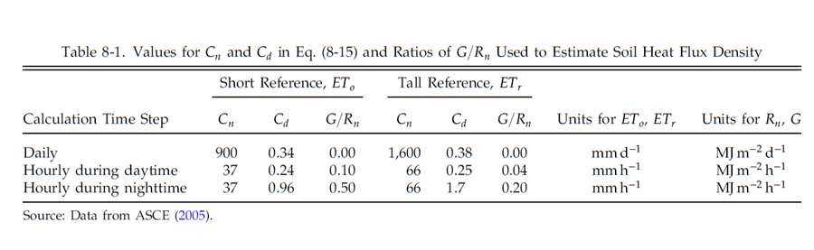
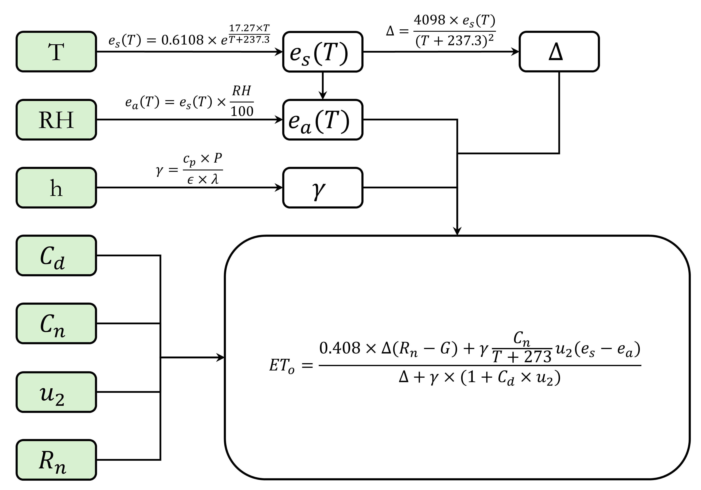

 

# A Python Toolkit for Reference Evapotranspiration ($ET_o$) Calculation Directly from Pandas DataFrames

## FAO-56 Penman-Monteith Method (daily)
$$ET_o=\frac{0.408\cdot \Delta (R_n-G)+\gamma \frac{C_n}{T+273} u_2 (e_s-e_a)}
{\Delta + \gamma (1+ C_d\cdot u_2)}$$
where: 
- $ET_o$: reference ET (mm/day) 
- ---
- $T$: air temperature at 2 m height ($\degree C$), `required input`
- $u_2$: wind speed at 2 m height ($m/s$), `required input`
- $R_n$: net radiation at crop surface ($Wh/m^2/day \cdot 0.0036 = MJ/m^2/day$), `required input` 
- ---
- $G$: soil heat flux ($MJ/m^2/day$), usually ~0 for daily time step, `optional input`
- --- 
- $e_s$: saturation vapor pressure ($kPa$), `optional input` 
- $e_a$: actual vapor pressure ($kPa$), `optional input` 
- ---
- $\Delta$: slope of the saturation vapor pressure curve ($kPa/\degree C$), `can be calculated`
- $\gamma$: psychrometric constant ($kPa/\degree C$), `can be calculated`
- ---
- $C_n, C_d$: they are parameters which can be found in the [Table 8-1](https://doi.org/10.1061/9780784414057) below. For California (e.g., CIMIS), the short-reference parameter is used: $C_n=900, C_d=0.34$

<em>Figure 1. Conceptual framework of the Penman-Monteith workflow, which is easy to understand how to use values from meteorological stations for $ET_o$ calculation. 

### Calculation of the slope of the saturation vapor pressure curve ($kPa/\degree C$)

$$\Delta=\frac{4098~e_s(T)}{(T+237.3)^2}$$

where:
- $T$: mean daily air temperature ($\degree C$), `required input`
- $e_s(T)$: saturation vapor pressure at temperature T ($\degree C$), in $kPa$, `can be calculated` as below

### Calculation of the saturation and actual vapor pressure ($kPa$)
$$e_s(T)=0.6108e^{\frac{17.27\cdot T}{T+237.3}}$$

$$e_a(T)=e_s(T)\cdot \frac{RH}{100}$$ 

where the $RH$: relative humidity (%), `required input`

### Calculation of the psychrometric constant ($kPa/\degree C$)
$$\gamma=\frac{c_p\cdot P}{\epsilon \cdot \lambda}$$ 
where:
- $c_p$: specific heat of moist air, $~1.013 \times 10^{-3}MJ/kg/\degree C$
- $\epsilon$: the ratio of molecular weight of water vapor to dry air, $~0.622$
- $\lambda$: the latent heat of vaporization, $2.45~MJ/kg$
- $P$: atmospheric pressure (kPa), `optional input`
$$P=101.3\times{\frac{293-0.0065\times h}{293}}^{5.26}$$
- $h$: meters above sea level (m), `required input`

## Hargreaves Method (daily)

## Reference
- Task Committee on Revision of Manual 70. (2016, April). Evaporation, evapotranspiration, and irrigation water requirements. American Society of Civil Engineers.
- Torres, A. F., Walker, W. R., & McKee, M. (2011). Forecasting daily potential evapotranspiration using machine learning and limited climatic data. Agricultural Water Management, 98(4), 553-562.

## How to cite this work
Gao, R., Khan, M., & Viers, J. (2026). A Python Toolkit for Reference Evapotranspiration ($ET_o$) Calculation Directly from Pandas DataFrames. Zenodo. https://doi.org/10.5281/zenodo.xxxxxxxx

## Repository update information
- Creation date: 2026-03-20
- Last update: 2026-03-23
- **Contact:** If you encounter any issues or have questions, please contact Rui Gao:
    - Rui.Ray.Gao@gmail.com
    - RuiGao@ucmerced.edu