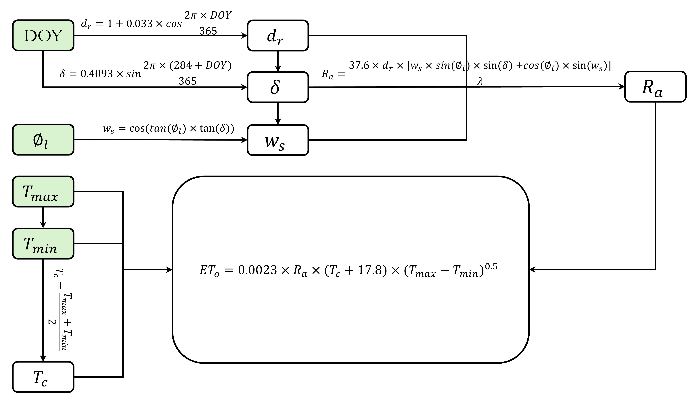

[](https://doi.org/10.5281/zenodo.19197914)
<br>

# A Python Toolkit for Reference Evapotranspiration ($ET_o$) Calculation Directly from Pandas DataFrames
This repository provides a standardized Python implementation for estimating reference evapotranspiration ($ET_o$) using two primary methodologies: the ASCE Penman-Monteith (PM) model—supporting both daily and hourly temporal resolutions—and the Hargreaves-Samani empirical equation. Designed for seamless integration with user-provided Pandas DataFrames, the toolkit can be used based on the meteorological data from traditional weather stations or high-frequency observations derived from eddy-covariance flux towers. <br>

This documentation is structured into two main sections:
- **Functional Guide:** A practical overview of how to import, call, and implement the core functions for $ET_o$ calculation within your research workflow.
- **Theoretical Framework:** A detailed technical reference covering the underlying physical formulas, coefficient derivations, required inputs, etc. for each supported method.


## How To Use This Repository?
### Repository installation
```bash
pip install "git+https://github.com/RuiGao9/pyETo.git" 
```

### Import functions
The `examples/eto_playground.ipynb` notebook provides a comprehensive implementation of reference evapotranspiration ($ET_o$) estimation. It demonstrates workflows for the ASCE Penman-Monteith method (at both daily and hourly resolutions) and the Hargreaves-Samani empirical model.<br>
To get started, initialize the environment by importing the core modules:
```python
import pandas as pd
import numpy as np
import matplotlib.pyplot as plt

import py_eto
from py_eto import helpers
from py_eto.helpers import calc_es_ea, calc_gamma, calc_pressure, calc_delta, convert_energy
```

### Daily PM-ETo
Preparing a dataframe and feed it to the `py_eto.pm_daily` funciton:
```python
df['ETo_PM_Daily'] = py_eto.pm_daily(
    t_mean=df['T'], 
    u2=df['u2'], 
    rn=convert_energy(df['Rn']),
    g=df['G'], 
    es=calc_es_ea(df['T'], df['RH'])[0], 
    ea=calc_es_ea(df['T'], df['RH'])[1],
    delta=calc_delta(df['T']),
    gamma=calc_gamma(calc_pressure(df['Elevation']), t_mean=df['T']),
    reference='short',
)
```

### Hourly PM-ETo
Preparing a dataframe and feed it to the `py_eto.pm_hourly` funciton:
```python
df['ETo_PM_Hourly'] = py_eto.pm_hourly(
    t_hr=df['T'], 
    u2_hr=df['u2'], 
    rn_hr=convert_energy(df['Rn']),
    es_hr=calc_es_ea(df['T'], df['rh_hr'])[0],
    ea_hr=calc_es_ea(df['T'], df['rh_hr'])[1],
    delta_hr=calc_delta(df['T']),
    gamma_hr=calc_gamma(calc_pressure(df['Elevation']), t_mean=df['T']),
    g_hr=convert_energy(df['G']), 
    reference='short',
)
```

### Hargreaves-ETo
Preparing a dataframe and feed it to the `py_eto.hargreaves` funciton:
```python
df['ETo_Hargreaves'] = py_eto.hargreaves(
    t_min=df['Tmin'],
    t_max=df['Tmax'],
    latitude=df['Latitude'],
    doy=df['DOY'],
    year=2025
)
```

## FAO-56 Penman-Monteith Method (Daily)
$$ET_o=\frac{0.408\cdot \Delta (R_n-G)+\gamma \frac{C_n}{T+273} u_2 (e_s-e_a)}
{\Delta + \gamma (1+ C_d\cdot u_2)}$$
where:<br>
- $ET_o$: reference ET (mm/day) 
- ---
- $T$: air temperature at 2 m height ($\degree C$), `required input`
- $u_2$: wind speed at 2 m height ($m/s$), `required input`
- $R_n$: net radiation at crop surface ($Wh/m^2/day \cdot 0.0036 = MJ/m^2/day$), `required input` 
- ---
- $G$: soil heat flux ($MJ/m^2/day$), usually ~0 for daily time step, `optional input`
- --- 
- $e_s$: saturation vapor pressure ($kPa$), `optional input` 
- $e_a$: actual vapor pressure ($kPa$), `optional input` 
- ---
- $\Delta$: slope of the saturation vapor pressure curve ($kPa/\degree C$), `can be calculated`
- $\gamma$: psychrometric constant ($kPa/\degree C$), `can be calculated`
- ---
- $C_n, C_d$: they are parameters which can be found in the [Table 8-1](https://doi.org/10.1061/9780784414057) below. For California (e.g., CIMIS), the short-reference parameter is used: $C_n=900, C_d=0.34$

<p align="center">

</p>

<p align="center">


<em>Figure 1. Conceptual framework of the Penman-Monteith workflow, which is easy to understand how to use values from meteorological stations for $ET_o$ calculation. </em>
</p>

### Calculation of the slope of the saturation vapor pressure curve ($kPa/^\circ C$)

$$\Delta=\frac{4098 \cdot e_s(T)}{(T+237.3)^2}$$

where:
- $T$: mean daily air temperature ($\degree C$), `required input`
- $e_s(T)$: saturation vapor pressure at temperature T ($\degree C$), in $kPa$, `can be calculated` as below

### Calculation of the saturation and actual vapor pressure ($kPa$)

$$e_s(T)=0.6108e^{\frac{17.27 \cdot T}{T+237.3}}$$

$$e_a(T)=e_s(T) \cdot \frac{RH}{100}$$ 

where the $RH$: relative humidity (%), `required input`

### Calculation of the psychrometric constant ($kPa/^\circ C$)

$$\gamma=\frac{c_p\cdot P}{\epsilon \cdot \lambda}$$ 

where:
- $c_p$: specific heat of moist air, $~1.013 \times 10^{-3}MJ/kg/^\circ C$
- $\epsilon$: the ratio of molecular weight of water vapor to dry air, ~$0.622$
- $\lambda$: the latent heat of vaporization, $2.45~MJ/kg$
- $P$: atmospheric pressure (kPa), `optional input`

$$P=101.3\times{\frac{293-0.0065\times h}{293}}^{5.26}$$

- $h$: meters above sea level (m), `required input`

## FAO-56 Penman-Monteith Method (Hourly)
The physical framework remains consistent with the daily step. The difference are listed below:
- **Dynamic Aerodynamic Coefficients ($C_n$ and $C_d$):** These parameters are adjusted based on the reference crop type (short - grass vs. tall - alfalfa) and prevailing radiation conditions ([Table 8-1](https://doi.org/10.1061/9780784414057)).
- **Diurnal Partitioning via Net Radiation ($R_n$):** The sign and magnitude of $R_n$ are utilized as the primary threshold to differentiate between daytime ($R_n > 0$) and nighttime ($R_n \le 0$) conditions. 
- **Ground Heat Flux ($G$) as One Optional Input:** The model provides the flexibility to utilize either measured or estimated soil heat flux data. If $G$ is directly monitored (e.g., via heat flux plates), the function prioritizes these observations for higher precision. In the absence of ground measurements, the model automatically estimates $G$ as a dynamic fraction of net radiation ($R_n$), applying distinct scaling factors for daytime and nighttime to capture the diurnal energy exchange between the surface and the subsurface.
 

## Hargreaves Method (Daily)

$$ETo=0.0023 \cdot R_a \cdot (T_{c}+17.8) \cdot \sqrt{T_{max} - T_{min}}$$

where:
- $0.0023$: the empirical value
- $T_{max}$: the maximum temperature in that day ($\degree C$)
- $T_{min}$: the minimum temperature in that day ($\degree C$)
- $T_{c}$: $\frac{T_{max}+T_{min}}{2}$ in that day ($\degree C$)
- $R_a$: extraterrestrial radiation, which can be estimated by latitude and the day of the year, as explained below:

<p align="center">


<em>Figure 2. Conceptual framework of the Hargreaves workflow. </em>
</p>

$$R_a=\frac{37.6 \cdot d_r \cdot [w_s \cdot sin(\phi_l)sin(\delta) + cos(\phi_l) \cdot sin(w_s)]}{\lambda}$$

$$\delta = 0.4093 \cdot sin(\frac{2 \pi (284+DOY)}{365})$$

$$d_r = 1 + 0.033 \cdot cos(\frac{2 \pi \cdot DOY}{365})$$

$$w_s = cos(tan(\phi_l) \cdot tan(\delta))$$

where:
- $d_r$: relative distance from the earth to the sun
- $DOY$: day of the year
- $w_s$: sunset hour angle (rad)
- $\phi_l$: latitude (rad)
- $\delta$: declination of the sun (rad) 
- $\lambda$: latent heat of vvaporization, $\lambda=2.54 MJ/kg$


## Reference
- Task Committee on Revision of Manual 70. (2016, April). Evaporation, evapotranspiration, and irrigation water requirements. American Society of Civil Engineers.
- Torres, A. F., Walker, W. R., & McKee, M. (2011). Forecasting daily potential evapotranspiration using machine learning and limited climatic data. Agricultural Water Management, 98(4), 553-562.


## How to cite this work
Gao, R., Khan, M., & Viers, J. (2026). A Python Toolkit for Reference Evapotranspiration ($ET_o$) Calculation Directly from Pandas DataFrames (Initial). Zenodo. https://doi.org/10.5281/zenodo.19197914


## Repository update information
- Creation date: 2026-03-20
- Last update: 2026-03-24
- **Contact:** If you encounter any issues or have questions, please contact Rui Gao:
    - Rui.Ray.Gao@gmail.com
    - RuiGao@ucmerced.edu
